# !blue

A Discord bot for pulling *Old School Runescape* hiscores, generating useful links, 
and common calculators.

* [Try the bot out](#try-the-bot-out)
* [Use](#use)
* [Commands](#commands)
  * [Help](#help)
  * [Levels](#levels)
  * [Scores](#scores)
  * [Calculators](#calculators)
  * [Links](#links)
  * [Other commands](#other-commands)
* [Dependencies](#dependencies)

## Try the bot out
You can test the bot [in my server](https://discord.gg/WUsZ5Hf). Feel free to leave suggestions in the `#suggestions` channel! You can report any issues you have with the bot [on the issue page](https://github.com/zedchance/blues_bot.py/issues).

## Use
Each command starts with `!blue` or `!b`. Summon a list of the bots commands by typing `!blue help`.  
`!blue help [command]` to see how to use the command  
`!blue help [Category]` to see a description of the category  
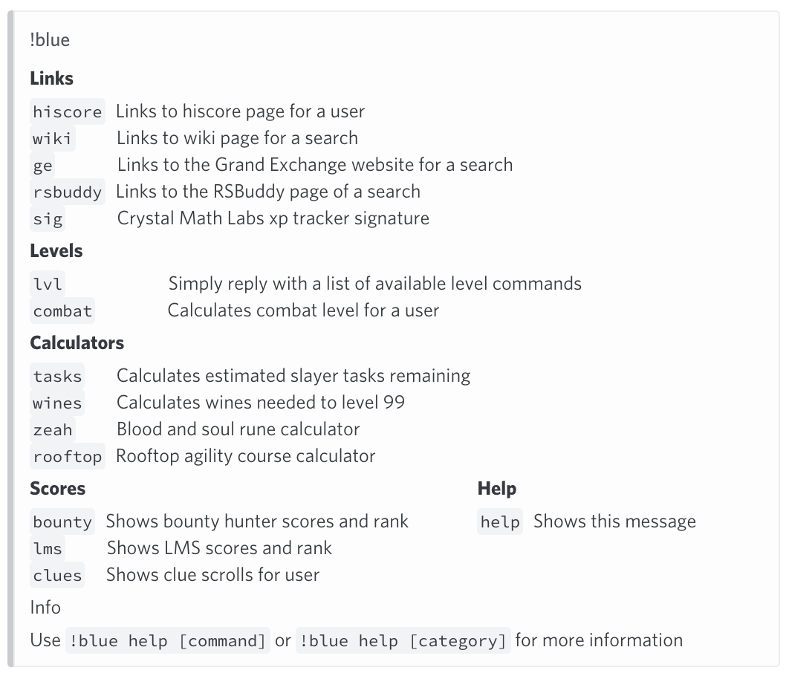

## Commands
### Help
`!b help`. The help command shows a list of all available commands. 

You can call `!b help` with a command name after to 
show information on how to use each command.  
For example: `!b help attack`  
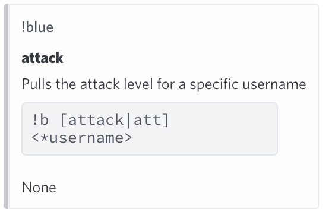

### Levels
`!b lvl` shows all the available commands.  
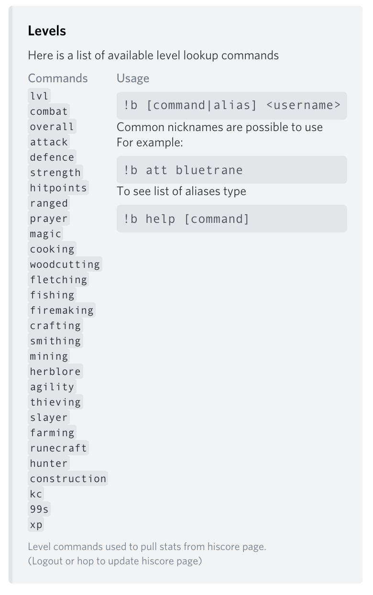

For example `!b attack bluetrane` returns:  
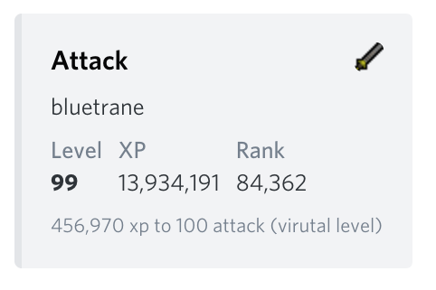

Or `!b total zezima`  
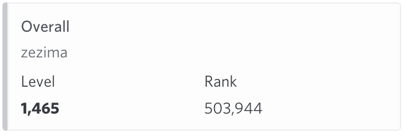

### Scores
`!b help Scores` shows a list of the commands available  
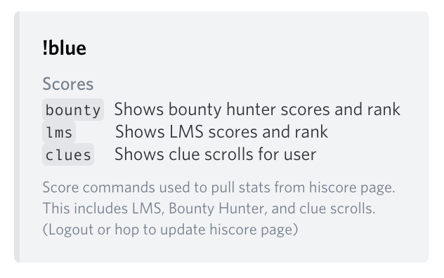

For example `!b clues bluetrane` returns  


### Calculators
`!b help Calculators` can be used to see all available calculators with short descriptions.  
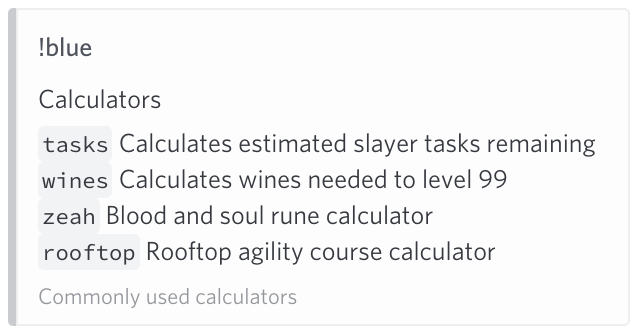

For example `!b wines zezima` returns  
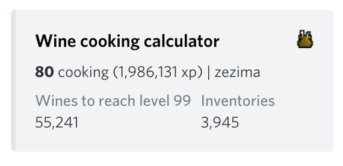

Or `!b rooftop bluetrane` returns  
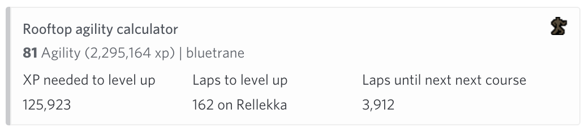

### Links
The bot can return useful URLs for an easy way to share/lookup a link.
`!b help Links` shows a list of available commands.  
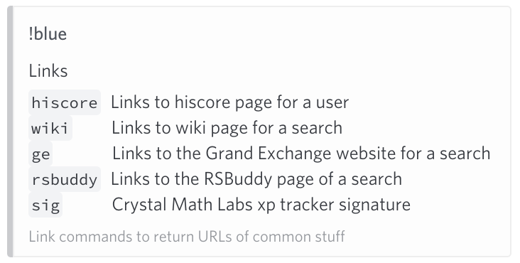

For example `!b ge trident` returns  
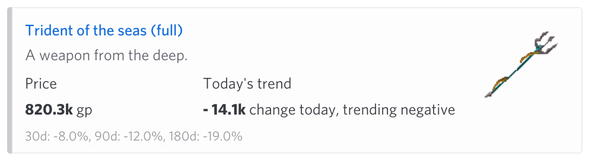

Or `!b wiki rune plate` returns
```
https://oldschool.runescape.wiki/?search=rune+plate
```

### Other commands
`!b version` shows the current version of the bot  
`!b bug` links to the [issue/bug](https://github.com/zedchance/blues_bot.py/issues) page

## Dependencies

Library | Description
--- | ---
[discord.py](https://discordpy.readthedocs.io/en/latest/) | Discord bot API
[requests](https://github.com/psf/requests) | HTTP request library
[BeautifulSoup](https://www.crummy.com/software/BeautifulSoup/) | Web scraping tool
[embed_help](https://github.com/zedchance/embed_help) | Better looking help messages
[matplotlib](https://matplotlib.org) | Python 2D plotting library